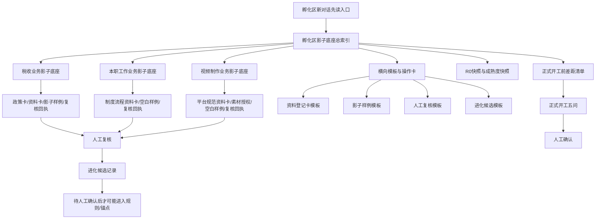

# 孵化区影子资产关系图

> 版本：v1.0
> 状态：影子资产关系图，不是系统架构图
> 边界声明：不接 n8n，不接企业微信，不写正式库，不触发真实业务动作。

```mermaid
flowchart TD
  A["孵化区新对话先读入口"] --> B["孵化区影子底座总索引"]
  B --> C["税收业务影子底座"]
  B --> D["本职工作业务影子底座"]
  B --> E["视频制作业务影子底座"]
  B --> F["横向模板与操作卡"]
  B --> G["R0快照与成熟度快照"]
  B --> H["正式开工前差距清单"]

  C --> C1["政策卡/资料卡/影子样例/复核回执"]
  D --> D1["制度流程资料卡/空白样例/复核回执"]
  E --> E1["平台规范资料卡/素材授权/空白样例/复核回执"]

  F --> F1["资料登记卡模板"]
  F --> F2["影子样例模板"]
  F --> F3["人工复核模板"]
  F --> F4["进化候选模板"]

  C1 --> I["人工复核"]
  D1 --> I
  E1 --> I
  I --> J["进化候选记录"]
  J --> K["待人工确认后才可能进入规则/锚点"]

  H --> L["正式开工五问"]
  L --> M["人工确认"]
```

## 读图说明

- 所有业务线都停留在影子底座。
- 人工复核后只进入进化候选，不自动写规则。
- 正式开工必须走差距清单和开工五问。
