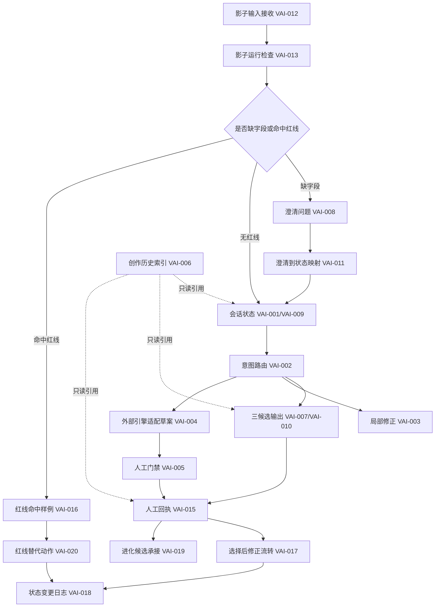

# VIDEO_AGENT_ASSET_RELATIONSHIP_MAP_001_VAI001至VAI020资产关系图_v1.0

> 资产身份：视频创作智能体影子层资产关系图
> 阶段：W1/R0
> 状态：文档关系图，不是服务编排
> 边界：只描述文件关系，不调用模型、企业微信、n8n、渲染器或发布器。

## 总体关系

## 分组说明

| 分组 | 资产 | 用途 |
|:---|:---|:---|
| 输入与状态 | VAI-001、VAI-006、VAI-009、VAI-012、VAI-018 | 记录影子会话、历史引用、输入和状态变化 |
| 路由与澄清 | VAI-002、VAI-008、VAI-011、VAI-013 | 判断意图、补齐字段、运行前检查 |
| 草案输出 | VAI-003、VAI-007、VAI-010、VAI-014、VAI-017 | 形成局部修正、三候选和修正流转文本草案 |
| 门禁与回执 | VAI-005、VAI-015、VAI-016、VAI-020 | 承接人工复核、红线登记和替代影子动作 |
| 适配与进化 | VAI-004、VAI-019 | 仅保留适配字段和候选经验，不调用引擎或升级规则 |

## 接续原则

1. 关系图只用于接续阅读，不代表自动化编排已上线。
2. 外部引擎适配节点只保留字段，不允许真实调用。
3. 红线节点必须阻断真实动作，只能流向替代影子动作。
